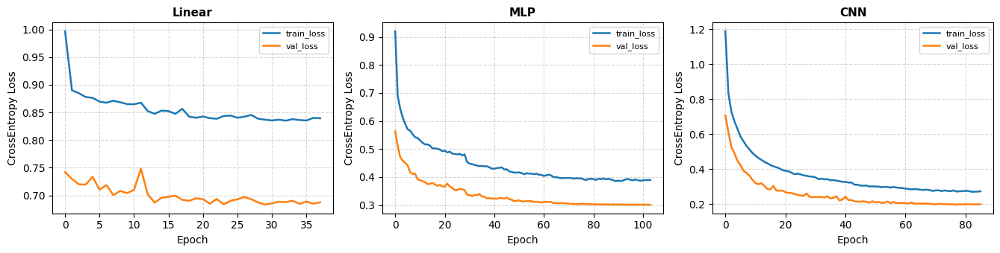
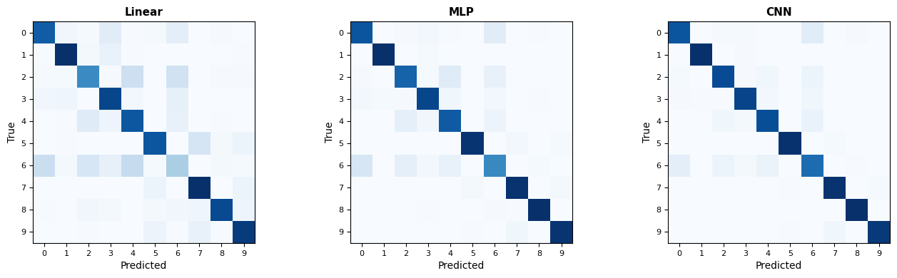
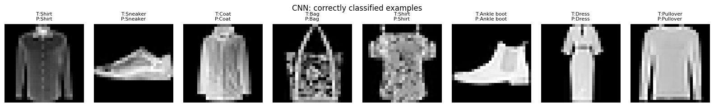
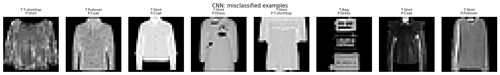

# Implementation Results — Assignment 1

This directory contains the experimental results, quantitative metric summaries, training curves, confusion matrices, and qualitative prediction diagnostics for **Assignment 1: Foundations of Deep Learning & Image Classification on Fashion-MNIST** (Course CO3133, Semester 261, Group 07).

---

## 1. Compliance with Handbook Guidelines (Section 3.3 & Section 12.1)

Per **Section 3.3 (Part 3 — Implementation Results)** and **Section 12.1 (Mandatory Comparison Outputs)** of the Course Project Handbook, the results are organized into three core analytical dimensions:
1. **Training Behavior**: Convergence curves, checkpoint selection, and over/underfitting diagnosis.
2. **Quantitative Results**: Multi-metric evaluation (Accuracy, Precision, Recall, Macro-F1), inference latency, parameter counts, and full 10-class breakdown.
3. **Qualitative Results**: Normalized confusion matrices and per-instance prediction diagnostics (correct vs. misclassified examples).

---

## 2. Key Findings & Metric Summary

### 2.1. Overall Performance Comparison Table

Evaluated on the full 10,000-sample Fashion-MNIST test benchmark across checkpoints restored from `best_val_loss`:

| # | Architecture | Parameters | Test Acc (Top-1) | Macro-Precision | Macro-Recall | Macro-F1 | Test Loss | Latency (ms/sample) | Training Time |
| :-: | :--- | :-: | :-: | :-: | :-: | :-: | :-: | :-: | :-: |
| **1** | **Linear / Softmax** | 7,850 | 74.60% | 0.7413 | 0.7460 | 0.7408 | 0.7189 | 0.1599 ms | ~1,142.2 s |
| **2** | **Multilayer Perceptron (MLP)** | 242,762 | 88.05% | 0.8797 | 0.8805 | 0.8798 | 0.3223 | 0.1590 ms | ~1,845.3 s |
| **3** | **Convolutional Neural Network (CNN)** | 231,626 | **91.85%** | **0.9192** | **0.9185** | **0.9187** | **0.2236** | 0.1616 ms | ~1,811.7 s |
| **4** | **LSTM / GRU** | — | — | — | — | — | — | — | *Under dev* |
| **5** | **Vision Transformer (ViT)** | — | — | — | — | — | — | — | *Under dev* |

---

## 3. Training Behavior & Learning Curves



### Diagnostic Analysis:
- **Linear Classifier (Underfitting):** Validation loss plateaus early around $0.7189$. With zero hidden layers, the linear model cannot separate non-linear boundary manifolds in pixel space, resulting in classic underfitting.
- **MLP (Controlled Overfitting):** Achieves smooth convergence down to $\text{val\_loss} = 0.3223$. The application of `Dropout(p=0.3)` across hidden dense layers prevents co-adaptation among the 242K parameters.
- **CNN (Optimal Generalization):** Reaches the lowest validation loss of $0.2236$. Batch normalization mitigates internal covariate shift, while spatial 2D dropout and pooling maintain high representational capacity with superior generalization.

---

## 4. Per-Class Precision, Recall, and F1 Breakdown

Full per-class evaluation across all 10 garment and footwear categories (1,000 test samples per class):

| ID | Class Name | Linear F1 | MLP F1 | CNN F1 | CNN Precision | CNN Recall | Diagnostic Takeaway |
| :-: | :--- | :-: | :-: | :-: | :-: | :-: | :--- |
| **0** | **T-shirt/top** | 0.7479 | 0.8246 | **0.8632** | 0.8780 | 0.8490 | Confused with Shirt and Dress. |
| **1** | **Trouser** | 0.8974 | 0.9790 | **0.9880** | 0.9890 | 0.9870 | Easiest class; distinct vertical geometry. |
| **2** | **Pullover** | 0.6119 | 0.7917 | **0.8882** | 0.8905 | 0.8860 | Long sleeves confused with Coat and Shirt. |
| **3** | **Dress** | 0.7718 | 0.8864 | **0.9194** | 0.9268 | 0.9120 | Distinct silhouette captured well by CNN. |
| **4** | **Coat** | 0.6907 | 0.7971 | **0.8713** | 0.8657 | 0.8770 | Visual overlap with Pullover; buttons/collars provide cues. |
| **5** | **Sandal** | 0.8025 | 0.9673 | **0.9845** | 0.9850 | 0.9840 | Open footwear clearly separated from shoes. |
| **6** | **Shirt** *(Hardest)* | 0.3473 | 0.6698 | **0.7495** | 0.7365 | 0.7630 | Highest error rate; heavy ambiguity with T-shirt/Coat. |
| **7** | **Sneaker** | 0.8306 | 0.9489 | **0.9650** | 0.9505 | 0.9800 | Minor confusion with Ankle boot. |
| **8** | **Bag** | 0.8647 | 0.9715 | **0.9890** | 0.9861 | 0.9920 | Handles and bounding shapes enable robust detection. |
| **9** | **Ankle boot** | 0.8431 | 0.9623 | **0.9691** | 0.9835 | 0.9550 | High-top collar distinguishes from Sneaker. |

---

## 5. Qualitative Results & Visual Evidence

### 5.1. Confusion Matrices


### 5.2. Correctly Classified Samples


### 5.3. Challenging Misclassifications


---

## 6. Directory Artifacts

```
Assignment1/05_results/
├── README.md
└── assets/
    ├── results_quantitative_comparison.png
    ├── results_training_curves.png
    ├── results_confusion_matrices.png
    ├── results_qualitative_correct.png
    └── results_qualitative_incorrect.png
```
